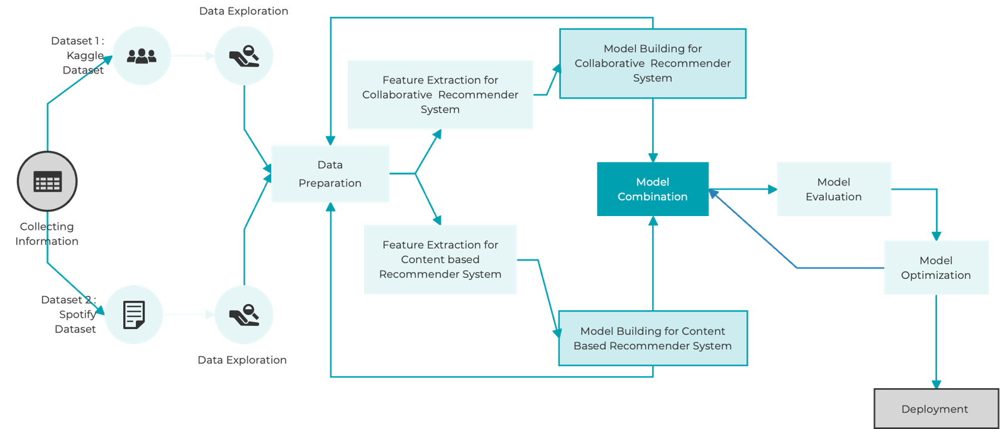

# DSCI-591 - Podcast Recommender System

Building a Hybrid podcast recommender system by merging content-based podcast recommender system and collaborative podcast recommender  system

## Overview

The purpose of building a podcast recommender system is to enhance the podcast listening experience for users by providing personalized recommendations tailored to their interests and preferences. Users now find it more and more challenging to find new podcasts they might appreciate due to the expansion of podcasting over the past several years. The majority of podcast listeners have a small number of favorites, and they are typically cautious to try something new. Users can't listen to the first ten seconds of a podcast or skim through a preview as they do with music or movies to decide whether they enjoy it. The issue of connecting consumers to podcasts they would appreciate is made more difficult by the length and topic diversity of podcasts. Additionally, people find it very hard to go through all of the podcasts and episodes to discover the one they enjoy owing to the overwhelming number of podcasts available.  
&nbsp&nbsp
  
  
  

## Content based recommendation system
One of the most common types of recommender systems used to offer recommendations to a user is a content-based system. This kind of recommendation system chooses products to propose based on comparable content after taking into account the user's interests and information. A content-based recommendation engine might pick a selection of podcasts (or even individual episodes) from the constantly expanding podcast library and decide what order to present them to a user. This system might examine podcast descriptions based on a user profile and find podcasts that match the user's tastes.

The algorithm needs knowledge about the products and the user's preferences to construct a content-based recommender system. A movie recommendation system, for instance, may take into account elements like genre, stars, directors, narrative keywords, or user ratings. Using this data, it creates a user profile or item profile that reflects the preferences of the person or the properties of the goods.

The content-based recommender system compares the user profile with the item profiles when a user asks suggestions to identify things that closely fit the user's tastes. It determines how closely each item profile and user profile match up, then suggests the products with the greatest similarity ratings.

## Collaborative recommender system

A collaborative filtering recommender system is a kind of recommendation system that makes recommendations to users based on their preferences and past actions of other users who share those preferences. Collaborative filtering examines patterns of user activity and discovers individuals with similar interests or preferences rather than depending exclusively on the attributes of the products themselves. 

Collaborative filtering systems may assess how similar users or items are using a variety of techniques. A well-liked tactic is to use a similarity metric, such cosine similarity or Pearson correlation coefficient. These measures determine the degree to which two vectors representing consumer preferences or product characteristics are comparable to one another.

Collaborative filtering has the advantage of being able to capture user preferences for specialized or unusual items since it relies on the preferences and behavior of comparable users. However, a substantial quantity of user interaction data is required in order to provide correct suggestions. Additionally, new products or users with limited data may be affected by the "cold-start" problem, in which there is not enough information to provide helpful recommendations.

## Advantages of merging and forming a hybrid recommender system

Merging collaborative filtering and content-based filtering in a hybrid recommender system can provide several advantages over using either method alone:

1. Higher recommendation accuracy is possible with hybrid systems since they use the advantages of both methodologies. While content-based filtering can offer suggestions based on the qualities and properties of objects, collaborative filtering is useful in collecting user preferences and providing tailored recommendations. By combining the two approaches, the system may get beyond the drawbacks and biases of each and produce suggestions that are more precise and varied.
2. Overcoming the cold-start issue: The cold-start issue, when there is little or no user data available for new items or users, is a common challenge for collaborative filtering. This problem can be solved by content-based filtering, which bases its suggestions on the properties of the items. The system can utilize the content-based approach to offer items to new users or recommend new products to current users in the absence of user preferences.

3. Greater recommendation coverage: Since collaborative filtering has access to more user data, it tends to propose popular things more frequently. On the other hand, content-based filtering might suggest specialized or less well-known goods depending on their qualities. Hybrid systems can increase suggestion by combining the two ways to offer a wider range of recommendations that span both well-known and specialized products.

4. Serendipity and variety: By taking item properties into account, content-based filtering is noted for its capacity to introduce serendipity and diversity in suggestions. The hybrid approach may combine customized suggestions with the discovery of novel and varied products by combining it with collaborative filtering, which is based on user activity. By introducing users to a larger range of products they would not have otherwise discovered, this can increase user pleasure and engagement.

5. Robustness to sparsity and data sparsity: When there are few reviews or interactions for products or people, collaborative filtering may experience data sparsity problems. Since it is based on item qualities, content-based filtering is not impacted by data scarcity. A hybrid system that incorporates both techniques can lessen the effects of data sparsity and produce more reliable suggestions.

6. Flexibility and adaptability: By enabling the system to move between collaborative filtering and content-based filtering depending on the availability and quality of data, hybrid recommender systems provide flexibility and adaptability. Depending on the user, item, or contextual circumstances, it may dynamically alter the recommendation method to provide tailored and useful recommendations in a variety of situations.

## Data

It often becomes necessary to combine several datasets when developing a recommendation system for podcasts. For our approach, One dataset contains detailed descriptions of podcasts, which can be used to build a content-based recommendation system. And, Another dataset contains reviews and ratings of the podcasts, which can be used to build a collaborative filtering-based recommendation system.

Here's an expanded explanation of how this integration can enhance the recommendation process:

+ Content-based recommendation system: The dataset containing detailed descriptions of podcasts is valuable for building a content-based recommendation system. This approach analyzes the textual information associated with each podcast, such as the title, description, episode summaries, and potentially even transcripts. By employing natural language processing (NLP) techniques, the system can extract relevant keywords, topics, and other metadata to understand the content of each podcast. This information forms the basis for recommending similar podcasts to users.

+ Collaborative filtering-based recommendation system: The dataset with reviews and ratings provides an opportunity to build a collaborative filtering-based recommendation system. Collaborative filtering considers the behavior and preferences of a user along with the collective behavior of a larger user community. By analyzing the reviews and ratings, the system can identify patterns and similarities between users' tastes. This enables the system to recommend podcasts that align with a user's interests based on the preferences of similar users.

Dataset 1 - Kaggle Podcast Review

Source: https://www.kaggle.com/datasets/thoughtvector/podcastreviews

* For collaborative filtering, the dataset includes podcast reviews and ratings which is essential since it offers information on how users evaluate each episode. This dataset includes details like user ratings, reviews, and comments that may be employed to create a model that forecasts how much a certain user will appreciate a specific podcast. 
* The collaborative filtering-based recommendation system uses this data to identify patterns in user behavior and preferences. 
* For instance, if a lot of users who like science and technology-related podcasts also give a certain podcast high ratings, the recommendation engine can use this information to offer that audio to other users who share their interests.

Dataset 2 - Spotify Podcast Data

Source: https://podcastsdataset.byspotify.com
* Using this dataset, a content-based filtering system can be developed to examine the podcast descriptions' text and identify important key topics, themes, or elements. Then, based on the features a user has previously enjoyed, it might suggest additional podcasts with a similar feature set. 
* One of the key benefits of content-based filtering is that it is not dependent on user feedback. As a result, it may also provide a user additional recommendations that are catered to their unique interests. 
* The key takeaway is to analyze the properties, such as the podcast's description text or its linked keywords, and utilize those features to find related products that a user could also find interesting.

